# Reddit Clone - Architecture Diagrams

## 🏗️ High-Level System Architecture


## 🔄 Data Flow Architecture


## 🗄️ Database Schema Architecture


## 🔐 Security Architecture


## 📊 Performance & Scalability Architecture

```mermaid
graph TB
    subgraph "Client-Side Optimization"
        CDN[CloudFront CDN<br/>• Global Edge Locations<br/>• Static Asset Caching<br/>• Gzip Compression]
        CACHE[Browser Caching<br/>• HTTP Cache Headers<br/>• Service Worker<br/>• Local Storage]
    end
    
    subgraph "API Layer Optimization"
        RATE[Rate Limiting<br/>• Per-User Limits<br/>• API Throttling<br/>• Burst Handling]
        COMPRESS[Response Compression<br/>• Gzip Encoding<br/>• JSON Minification<br/>• Image Optimization]
    end
    
    subgraph "Compute Optimization"
        WARM[Lambda Warm-up<br/>• Provisioned Concurrency<br/>• Connection Pooling<br/>• Cold Start Mitigation]
        ASYNC[Async Processing<br/>• Non-blocking Operations<br/>• Background Tasks<br/>• Event-driven Architecture]
    end
    
    subgraph "Database Optimization"
        INDEX[Database Indexing<br/>• GSI Optimization<br/>• Query Patterns<br/>• Partition Keys]
        CACHE_DB[Database Caching<br/>• DynamoDB Accelerator<br/>• Query Result Caching<br/>• Session Storage]
    end
    
    subgraph "Monitoring & Auto-scaling"
        METRICS[Performance Metrics<br/>• Response Times<br/>• Throughput<br/>• Error Rates]
        AUTO[Auto-scaling<br/>• Lambda Concurrency<br/>• DynamoDB Capacity<br/>• CloudFront Distribution]
    end
    
    %% Flow
    CDN --> CACHE
    CACHE --> RATE
    RATE --> COMPRESS
    COMPRESS --> WARM
    WARM --> ASYNC
    ASYNC --> INDEX
    INDEX --> CACHE_DB
    CACHE_DB --> METRICS
    METRICS --> AUTO
    
    %% Styling
    classDef clientStyle fill:#e8f5e8,stroke:#2e7d32,stroke-width:2px
    classDef apiStyle fill:#e3f2fd,stroke:#1565c0,stroke-width:2px
    classDef computeStyle fill:#fce4ec,stroke:#880e4f,stroke-width:2px
    classDef dbStyle fill:#fff3e0,stroke:#ef6c00,stroke-width:2px
    classDef monitorStyle fill:#f3e5f5,stroke:#4a148c,stroke-width:2px
    
    class CDN,CACHE clientStyle
    class RATE,COMPRESS apiStyle
    class WARM,ASYNC computeStyle
    class INDEX,CACHE_DB dbStyle
    class METRICS,AUTO monitorStyle
```



## 🚀 Deployment Architecture

```mermaid
graph TB
    subgraph "Development Environment"
        DEV_CODE[Development Code<br/>• Local Development<br/>• Feature Branches<br/>• Unit Testing]
        DEV_DEPLOY[Dev Deployment<br/>• Staging Environment<br/>• Integration Testing<br/>• Performance Testing]
    end
    
    subgraph "CI/CD Pipeline"
        GIT[Git Repository<br/>• Code Versioning<br/>• Pull Requests<br/>• Code Reviews]
        GHA[GitHub Actions<br/>• Automated Testing<br/>• Build Process<br/>• Deployment Triggers]
        CDK[AWS CDK<br/>• Infrastructure as Code<br/>• Environment Management<br/>• Resource Provisioning]
    end
    
    subgraph "Production Environment"
        PROD_LAMBDA[Production Lambda<br/>• Multi-region Deployment<br/>• Auto-scaling<br/>• Monitoring]
        PROD_DB[Production Database<br/>• DynamoDB Global Tables<br/>• Backup & Recovery<br/>• Point-in-time Recovery]
        PROD_CDN[Production CDN<br/>• Global Distribution<br/>• Edge Caching<br/>• SSL/TLS Termination]
    end
    
    subgraph "Monitoring & Maintenance"
        ALERTS[Alerting System<br/>• CloudWatch Alarms<br/>• SNS Notifications<br/>• PagerDuty Integration]
        LOGS[Centralized Logging<br/>• CloudWatch Logs<br/>• Log Aggregation<br/>• Log Analysis]
        BACKUP[Backup & Recovery<br/>• Automated Backups<br/>• Disaster Recovery<br/>• Data Retention]
    end
    
    %% Development Flow
    DEV_CODE --> GIT
    GIT --> GHA
    GHA --> DEV_DEPLOY
    
    %% CI/CD Flow
    GHA --> CDK
    CDK --> PROD_LAMBDA
    CDK --> PROD_DB
    CDK --> PROD_CDN
    
    %% Production Flow
    PROD_LAMBDA --> ALERTS
    PROD_DB --> BACKUP
    PROD_CDN --> LOGS
    
    %% Styling
    classDef devStyle fill:#e8f5e8,stroke:#2e7d32,stroke-width:2px
    classDef cicdStyle fill:#e3f2fd,stroke:#1565c0,stroke-width:2px
    classDef prodStyle fill:#fff3e0,stroke:#ef6c00,stroke-width:2px
    classDef monitorStyle fill:#f3e5f5,stroke:#4a148c,stroke-width:2px
    
    class DEV_CODE,DEV_DEPLOY devStyle
    class GIT,GHA,CDK cicdStyle
    class PROD_LAMBDA,PROD_DB,PROD_CDN prodStyle
    class ALERTS,LOGS,BACKUP monitorStyle
```



## 📱 Frontend Architecture

```mermaid
graph TB
    subgraph "Presentation Layer"
        UI[UI Components<br/>• Material-UI<br/>• Custom Components<br/>• Responsive Design]
        ROUTES[Routing<br/>• React Router<br/>• Protected Routes<br/>• Lazy Loading]
    end
    
    subgraph "State Management"
        REDUX[Redux Store<br/>• Centralized State<br/>• Predictable Updates<br/>• Time Travel Debugging]
        SLICES[Redux Slices<br/>• Auth Slice<br/>• Posts Slice<br/>• Comments Slice<br/>• Subreddits Slice]
    end
    
    subgraph "Business Logic"
        SERVICES[API Services<br/>• HTTP Client<br/>• Request/Response<br/>• Error Handling]
        HOOKS[Custom Hooks<br/>• Data Fetching<br/>• State Management<br/>• Side Effects]
    end
    
    subgraph "Data Layer"
        API[Backend API<br/>• REST Endpoints<br/>• Authentication<br/>• Data Validation]
        CACHE[Client Cache<br/>• Local Storage<br/>• Session Storage<br/>• Memory Cache]
    end
    
    subgraph "Performance Optimization"
        LAZY[Code Splitting<br/>• Dynamic Imports<br/>• Route-based Splitting<br/>• Component Lazy Loading]
        MEMO[Memoization<br/>• React.memo<br/>• useMemo<br/>• useCallback]
    end
    
    %% Flow
    UI --> ROUTES
    ROUTES --> REDUX
    REDUX --> SLICES
    SLICES --> SERVICES
    SERVICES --> HOOKS
    HOOKS --> API
    API --> CACHE
    CACHE --> LAZY
    LAZY --> MEMO
    
    %% Styling
    classDef uiStyle fill:#e8f5e8,stroke:#2e7d32,stroke-width:2px
    classDef stateStyle fill:#e3f2fd,stroke:#1565c0,stroke-width:2px
    classDef logicStyle fill:#fce4ec,stroke:#880e4f,stroke-width:2px
    classDef dataStyle fill:#fff3e0,stroke:#ef6c00,stroke-width:2px
    classDef perfStyle fill:#f3e5f5,stroke:#4a148c,stroke-width:2px
    
    class UI,ROUTES uiStyle
    class REDUX,SLICES stateStyle
    class SERVICES,HOOKS logicStyle
    class API,CACHE dataStyle
    class LAZY,MEMO perfStyle
```



## 📊 Data Model Architecture

```mermaid
graph TB
    subgraph "Core Entities"
        USER["User Entity
        • user_id (PK)
        • username, email
        • profile data
        • authentication info"]
        POST["Post Entity
        • post_id (PK)
        • title, content
        • author_id (FK)
        • subreddit_id (FK)
        • voting data"]
        COMMENT["Comment Entity
        • comment_id (PK)
        • content
        • author_id (FK)
        • post_id (FK)
        • parent_comment_id (FK)"]
        SUBREDDIT["Subreddit Entity
        • subreddit_id (PK)
        • name, display_name
        • owner_id (FK)
        • community settings"]
    end
    
    subgraph "Relationship Tables"
        SUBSCRIPTION["Subscription Table
        • subscription_id (PK)
        • user_id (FK)
        • subreddit_id (FK)
        • subscription_date"]
        USER_FEED["User Feed Table
        • feed_id (PK)
        • user_id (FK)
        • post_id (FK)
        • score, timestamp"]
    end
    
    subgraph "Data Access Patterns"
        QUERY1["Query Pattern 1
        Get User Posts
        GSI: AuthorIndex"]
        QUERY2["Query Pattern 2
        Get Subreddit Posts
        GSI: SubredditIndex"]
        QUERY3["Query Pattern 3
        Get Post Comments
        GSI: PostIndex"]
        QUERY4["Query Pattern 4
        Get User Feed
        GSI: UserFeedIndex"]
    end
    
    %% Entity Relationships
    USER -->|creates| POST
    USER -->|writes| COMMENT
    USER -->|owns| SUBREDDIT
    USER -->|subscribes| SUBSCRIPTION
    USER -->|has| USER_FEED
    
    SUBREDDIT -->|contains| POST
    SUBREDDIT -->|has| SUBSCRIPTION
    
    POST -->|has| COMMENT
    POST -->|appears_in| USER_FEED
    
    COMMENT -->|replies_to| COMMENT
    
    %% Query Patterns
    QUERY1 --> USER
    QUERY1 --> POST
    QUERY2 --> SUBREDDIT
    QUERY2 --> POST
    QUERY3 --> POST
    QUERY3 --> COMMENT
    QUERY4 --> USER
    QUERY4 --> USER_FEED
    
    %% Styling
    classDef entityStyle fill:#e8f5e8,stroke:#2e7d32,stroke-width:2px
    classDef relationStyle fill:#e3f2fd,stroke:#1565c0,stroke-width:2px
    classDef queryStyle fill:#fff3e0,stroke:#ef6c00,stroke-width:2px
    
    class USER,POST,COMMENT,SUBREDDIT entityStyle
    class SUBSCRIPTION,USER_FEED relationStyle
    class QUERY1,QUERY2,QUERY3,QUERY4 queryStyle
```



## 🗃️ Data Model Details

### **User Model**
```json
{
  "user_id": "user_1234567890_abcdef",
  "username": "johndoe",
  "email": "john@example.com",
  "display_name": "John Doe",
  "bio": "Software Developer",
  "avatar": "https://s3.amazonaws.com/avatars/user_123.jpg",
  "is_public": true,
  "created_at": "2024-01-01T00:00:00Z",
  "updated_at": "2024-01-01T00:00:00Z",
  "cognito_user_id": "cognito-uuid-123",
  "email_verified": true,
  "last_login": "2024-01-01T12:00:00Z"
}
```

### **Post Model**
```json
{
  "post_id": "post_1234567890_abcdef",
  "title": "My First Post",
  "content": "This is the content of my post",
  "author_id": "user_1234567890_abcdef",
  "author_username": "johndoe",
  "subreddit_id": "subreddit_1234567890_abcdef",
  "subreddit_name": "programming",
  "post_type": "text",
  "url": null,
  "media_urls": ["https://s3.amazonaws.com/media/post_123.jpg"],
  "score": 15,
  "upvotes": 20,
  "downvotes": 5,
  "comment_count": 8,
  "view_count": 150,
  "is_nsfw": false,
  "is_spoiler": false,
  "flair": "Discussion",
  "tags": ["programming", "tutorial"],
  "created_at": "2024-01-01T00:00:00Z",
  "updated_at": "2024-01-01T00:00:00Z",
  "is_deleted": false,
  "is_locked": false,
  "is_sticky": false
}
```

### **Comment Model**
```json
{
  "comment_id": "comment_1234567890_abcdef",
  "content": "Great post! Thanks for sharing.",
  "author_id": "user_1234567890_abcdef",
  "author_username": "johndoe",
  "post_id": "post_1234567890_abcdef",
  "subreddit_id": "subreddit_1234567890_abcdef",
  "subreddit_name": "programming",
  "parent_comment_id": null,
  "comment_type": "comment",
  "score": 5,
  "upvotes": 7,
  "downvotes": 2,
  "is_nsfw": false,
  "is_spoiler": false,
  "flair": "Support",
  "tags": ["positive", "feedback"],
  "created_at": "2024-01-01T00:00:00Z",
  "updated_at": "2024-01-01T00:00:00Z",
  "is_deleted": false,
  "depth": 0
}
```

### **Subreddit Model**
```json
{
  "subreddit_id": "subreddit_1234567890_abcdef",
  "name": "programming",
  "display_name": "Programming",
  "description": "A community for programmers to discuss coding",
  "rules": [
    "Be respectful and civil",
    "No spam or self-promotion",
    "Use descriptive titles"
  ],
  "owner_id": "user_1234567890_abcdef",
  "moderators": ["user_1234567890_abcdef"],
  "subscriber_count": 1000,
  "post_count": 500,
  "primary_color": "#FF6B35",
  "secondary_color": "#F7F7F7",
  "icon": "https://s3.amazonaws.com/icons/programming.png",
  "banner": "https://s3.amazonaws.com/banners/programming.jpg",
  "is_private": false,
  "is_nsfw": false,
  "is_restricted": false,
  "language": "en",
  "country": "US",
  "created_at": "2024-01-01T00:00:00Z",
  "updated_at": "2024-01-01T00:00:00Z"
}
```

### **Database Indexes**

#### **Primary Indexes**
- **Users Table**: `user_id` (Partition Key)
- **Posts Table**: `post_id` (Partition Key)
- **Comments Table**: `comment_id` (Partition Key)
- **Subreddits Table**: `subreddit_id` (Partition Key)

#### **Global Secondary Indexes (GSI)**
- **Users Table**:
  - `UsernameIndex`: `username` (Partition Key)
  - `EmailIndex`: `email` (Partition Key)
- **Posts Table**:
  - `AuthorIndex`: `author_id` (Partition Key), `created_at` (Sort Key)
  - `SubredditIndex`: `subreddit_id` (Partition Key), `created_at` (Sort Key)
  - `ScoreIndex`: `score` (Partition Key), `created_at` (Sort Key)
- **Comments Table**:
  - `PostIndex`: `post_id` (Partition Key), `created_at` (Sort Key)
  - `AuthorIndex`: `author_id` (Partition Key), `created_at` (Sort Key)
  - `ParentIndex`: `parent_comment_id` (Partition Key), `created_at` (Sort Key)
- **Subreddits Table**:
  - `NameIndex`: `name` (Partition Key)
  - `OwnerIndex`: `owner_id` (Partition Key), `created_at` (Sort Key)

### **Query Patterns**

#### **1. Get User Posts**
```python
# Query: Get posts by user with pagination
response = posts_table.query(
    IndexName='AuthorIndex',
    KeyConditionExpression='author_id = :user_id',
    ExpressionAttributeValues={':user_id': user_id},
    ScanIndexForward=False,  # Sort by created_at descending
    Limit=20
)
```

#### **2. Get Subreddit Posts**
```python
# Query: Get posts from subreddit with pagination
response = posts_table.query(
    IndexName='SubredditIndex',
    KeyConditionExpression='subreddit_id = :subreddit_id',
    ExpressionAttributeValues={':subreddit_id': subreddit_id},
    ScanIndexForward=False,
    Limit=20
)
```

#### **3. Get Post Comments**
```python
# Query: Get comments for a post
response = comments_table.query(
    IndexName='PostIndex',
    KeyConditionExpression='post_id = :post_id',
    ExpressionAttributeValues={':post_id': post_id},
    ScanIndexForward=True,  # Sort by created_at ascending
    Limit=50
)
```

#### **4. Get User Feed**
```python
# Query: Get personalized feed for user
response = user_feeds_table.query(
    KeyConditionExpression='user_id = :user_id',
    ExpressionAttributeValues={':user_id': user_id},
    ScanIndexForward=False,
    Limit=20
)
```

---

## 📋 Architecture Summary

### **Key Components:**
- **6 Lambda Functions** for microservices architecture
- **6 DynamoDB Tables** with optimized indexing
- **API Gateway** for unified API management
- **CloudFront CDN** for global content delivery
- **AWS Cognito** for authentication and authorization
- **S3 Storage** for media and static assets

### **Scalability Features:**
- **Serverless Architecture** for automatic scaling
- **Global Distribution** with CloudFront
- **Database Sharding** with DynamoDB
- **Caching Strategy** at multiple layers
- **Performance Monitoring** with CloudWatch

### **Security Measures:**
- **Multi-layer Security** with WAF, IAM, and encryption
- **JWT Authentication** with AWS Cognito
- **Input Validation** and sanitization
- **Audit Logging** and monitoring

### **Deployment Strategy:**
- **Infrastructure as Code** with AWS CDK
- **CI/CD Pipeline** with GitHub Actions
- **Environment Management** for dev/staging/prod
- **Automated Testing** and deployment

This architecture provides a robust, scalable, and secure foundation for the Reddit Clone application with room for future enhancements and growth.
